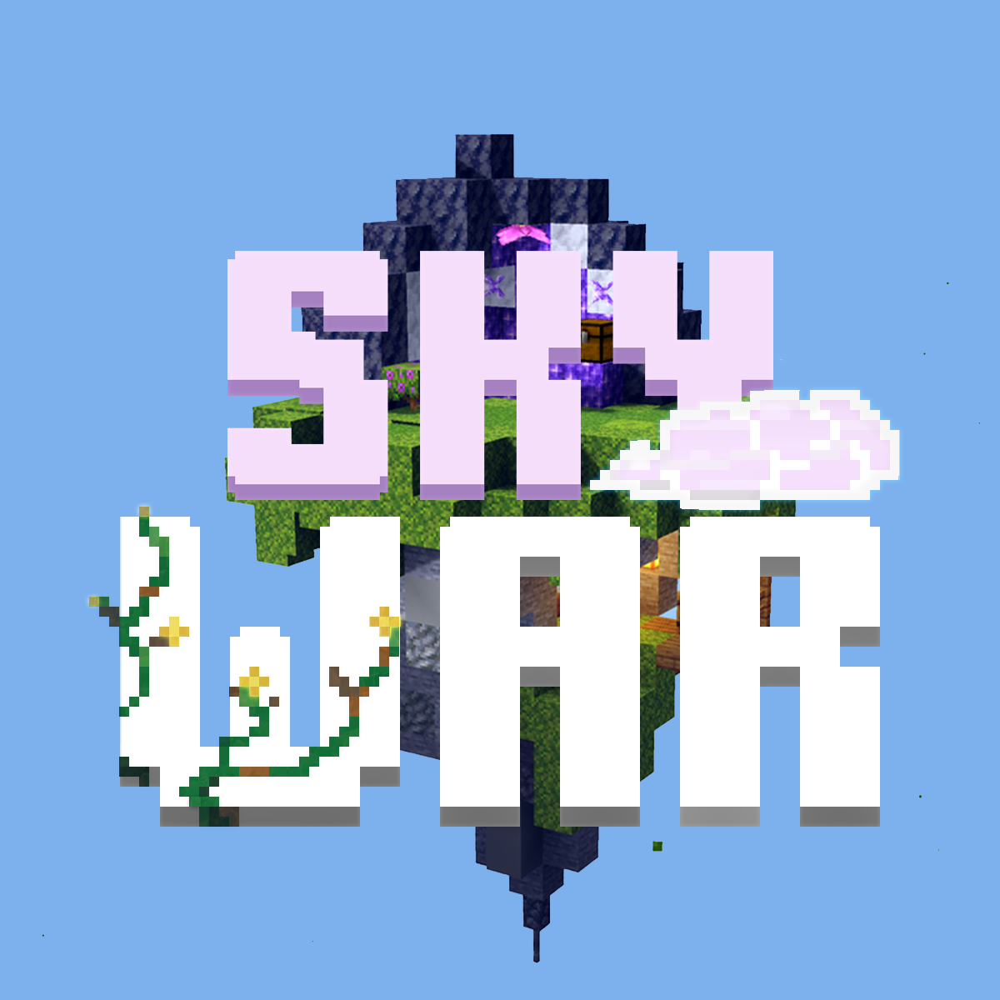

<h1>Skywar</h1><br>

<b>A skywar minegames plugin for PocketMine API 4.0</b><br>
[](https://github.com/Arisify/Skywar)
[](https://github.com/Arisify/Skywar/stargazers)

## ✨ Features
- Custom language ✔
- Documented config ✔
- Custom gameplay ✔
- UI settings 

## 💬 Commands

| Command                 | Description  | Permission             | Default     |
|-------------------------|--------------|------------------------|-------------|
| ```/sw```               | ```sw command``` | ```none```             | ```false``` |
| ```/sw help```          | ```sw help command``` | ```none```             | ```false``` |
| ```/sw join <groups>``` | ```Get sw item``` | ```swplus.get```     | ```true```  |
| ```/sw set```           | ```Spawn sw entity``` | ```swplus.spawn```   | ```true```  |
| ```/sw maps```          | `````` | ```swplus.despawn``` | ```true```  |

## ❔ Issues

Did you find a bug or error when using this plugin? feel free to open the
issues [here](https://github.com/Arisify/Skywar/issues/new)

## 🌟 Credits

Icon background was taken from [u/xDarkChaosx02](https://www.reddit.com/r/Minecraft/comments/pc0ao8/created_a_skywars_island_thoughts_ideas)